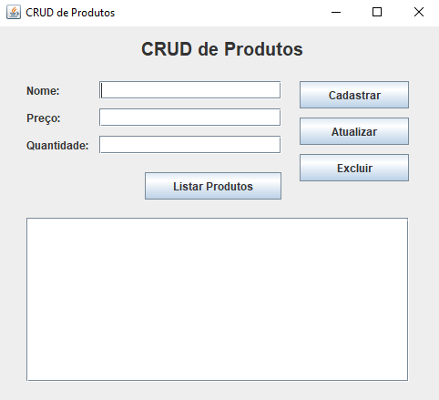

# CRUD-Sistema-de-Lista-de-Compras

## Autores

Guilherme Colatino

Lucas Eloi

Pedro Campos

Rogério Pedro

Ygor Thyago

## Descrição do Projeto

O objetivo deste projeto é desenvolver uma aplicação de **Gerenciamento de Lista de Compras** que permite ao usuário adicionar, visualizar, editar e remover itens. Cada item (`Produto`) possui **nome**, **preço unitário** e **quantidade**.

O sistema é construído para demonstrar a aplicação do padrão **Model-View-Controller (MVC)** em um contexto de aplicação de desktop simples, utilizando a biblioteca Swing para a interface gráfica.

## Tecnologias e Arquitetura

O projeto adota a arquitetura **Model-View-Controller (MVC)** para garantir a separação clara das responsabilidades entre a lógica de dados, a interface do usuário e o controle de fluxo.

### Arquitetura MVC

| Camada | Pacote | Responsabilidade |
| :--- | :--- | :--- |
| **Model** | `projetoModel` | Contém os dados e as regras de negócio dos itens. |
| **View** | `projetoView` |responsável pela **Interface Gráfica (GUI)** usando Swing. |
| **Controller** | `projetoController` | Gerencia a lista de itens (`ArrayList`) e manipula a lógica de CRUD. |

### Tecnologias Utilizadas

| Tecnologia | Notas |
| :--- | :--- |
| **Linguagem** | **Java** |
| **Interface Gráfica** | **Swing** |
| **Estrutura de Dados** | **java.util.ArrayList** (para a lista de compras em memória) |

## Fluxo de Execução

O sistema inicia e opera através da interação do usuário com a interface gráfica (View).

1.  **Inicialização:** A aplicação é iniciada diretamente na classe **ProdutoView**, que é, também, responsável por exibir a tela ao usuário.
2.  **Interação:** O usuário insere os dados do item (Nome, Preço, Qtd) na **View** e clica no botão "Cadastra".
3.  **Controle:** A **View** notifica o **ProdutoController** da ação.
4.  **Processamento:** O **Controller** cria um novo objeto **Produto** e o adiciona à sua lista interna.
5.  **Listar Produtos:** Ao clicar no botão "Listar Produtos" a tabela em baixo do botão atualiza com os produtos inseridos.
6.  **Atualizar:** Ao inserir alguma informação nova nos dados do item e clicar no botão "Atualizar", o produto é atualizado com os novos dados.
7.  **Excluir:** Ao clicar no botão "Excluir" e digitar o ID do produto desejado, o produto é deletado da lista.
